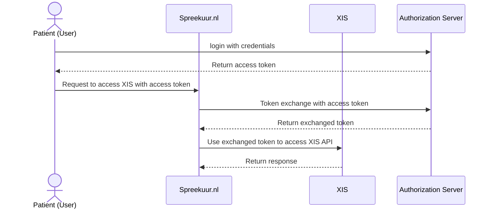
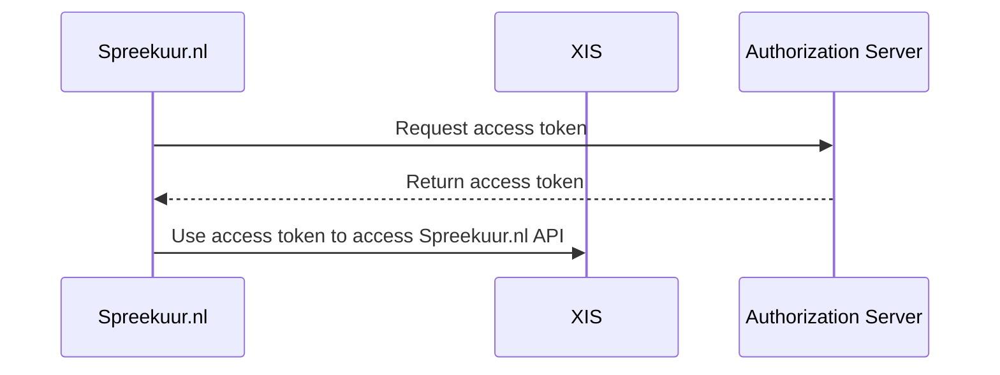
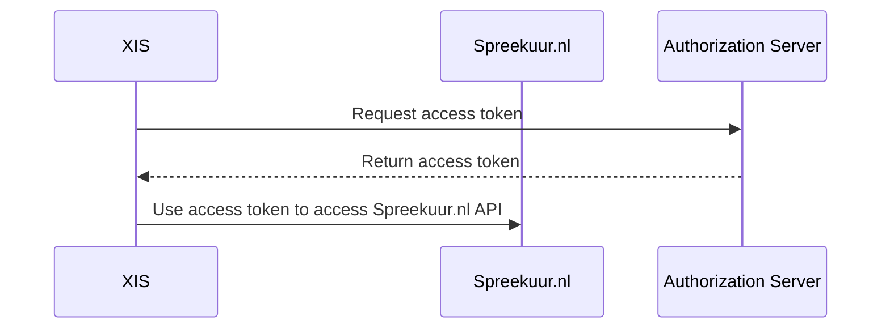

# Authentication and multi tenancy

## Authentication
### Authentication from Spreekuur.nl to XIS
Almost all authentication (with some exceptions) from Spreekuur.nl to the XIS is done using 
[OAuth Token Exchange](https://datatracker.ietf.org/doc/html/rfc8693). 

#### Authentication from Spreekuur.nl to XIS without currently logged in patient
In some cases, Spreekuur.nl needs to access the XIS API without a currently logged in patient. In this case, Spreekuur.nl
will use the [OAuth Client Credentials Grant](https://datatracker.ietf.org/doc/html/rfc6749#section-4.4) specification.

### Authentication from XIS to Spreekuur.nl

The XIS must authenticate to Spreekuur.nl using the
[OAuth 2.0 Client Credentials Grant](https://datatracker.ietf.org/doc/html/rfc6749#section-4.4) specification.

### Authorization server / Identity Provider
Topicus.Healthcare can provide an authorization server that can be used for all authentication / authorization. It is 
also possible to use an authorization server provided by the XIS provider.

## Multi tenancy
Spreekuur.nl is a multi-tenant application. This means that multiple organizations can use the same application,
but each organization has its own data and settings. 

To distinguish between different organizations, all API requests from Spreekuur.nl to XIS and vice versa must include the organisation AGB code in the `organisation_agb` header. 