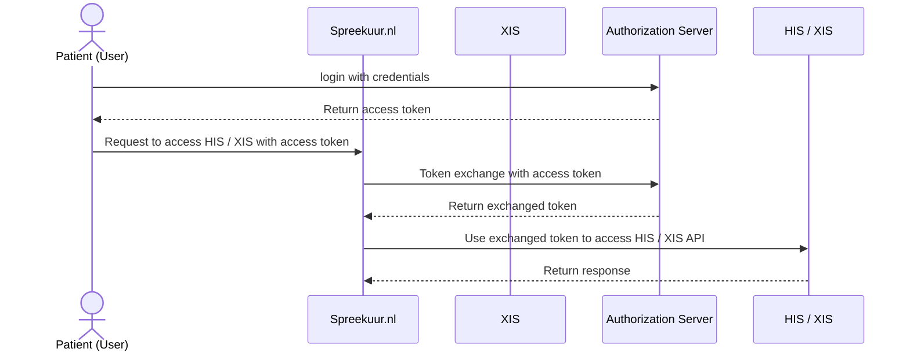
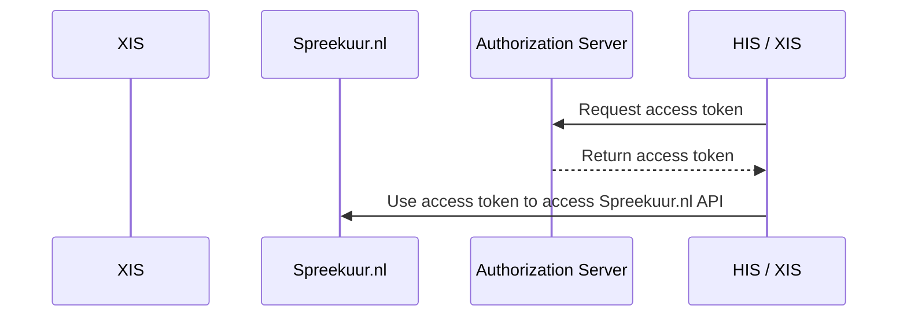

# Authentication and multi tenancy

## Authentication
### Authentication from Spreekuur.nl to HIS / XIS
Almost all authentication (with some exceptions) from Spreekuur.nl to the HIS / XIS is done using 
[OAuth Token Exchange](https://datatracker.ietf.org/doc/html/rfc8693). 

### Authentication from HIS / XIS to Spreekuur.nl

The HIS / XIS must authenticate to Spreekuur.nl using the
[OAuth 2.0 Client Credentials Grant](https://datatracker.ietf.org/doc/html/rfc6749#section-4.4) specification.

### Authorization server / Identity Provider
Topicus.Healthcare can provide an authorization server that can be used for all authentication / authorization. 

## Multi tenancy
Spreekuur.nl is a multi-tenant application. This means that multiple organizations can use the same application,
but each organization has its own data and settings. 

To distinguish between different organizations, all API requests from Spreekuur.nl to HIS / XIS and vice versa must include the organisation AGB code in the `organisation_agb` header. 