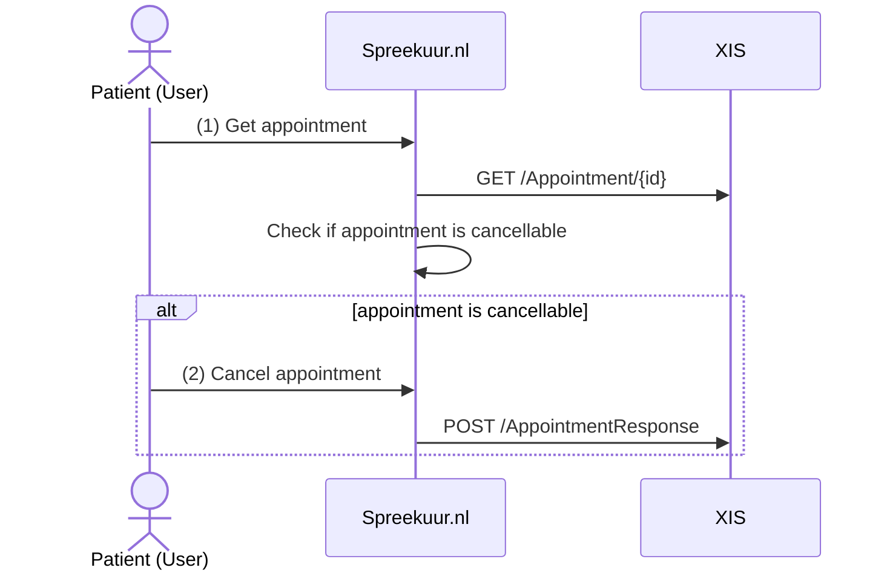

# Appointment cancellation

It is possible for the patient to cancel an appointment. Before the patient can cancel the appointment, the appointment 
resource is requested at the XIS. When the appointment is cancellable, the appointment cancel button is available.

1. The `Appointment` resource is used to check if the appointment is cancellable. See 
   [Appointment](api-xis/api-xis-v1.mdx#operation/searchAppointments) for the expected response.
2. The `AppointmentResponse` resource is used to cancel the appointment. See [AppointmentResponse](api-spreekuur.mdx#operation/createAppointmentResponse).