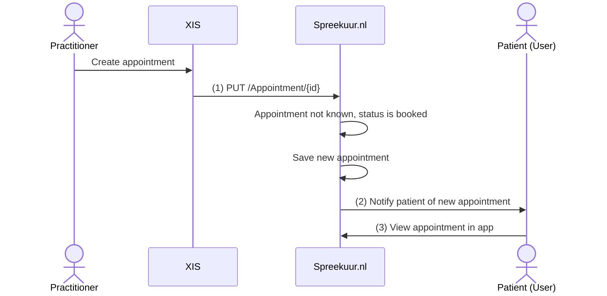
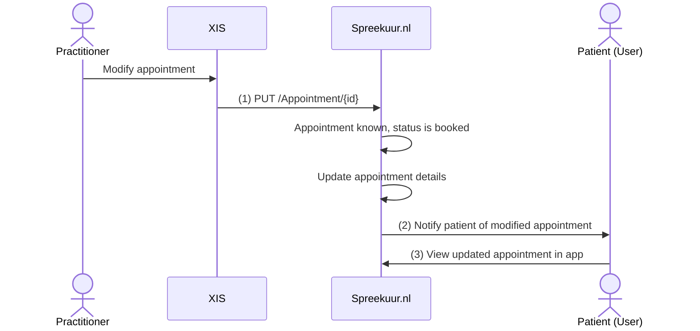
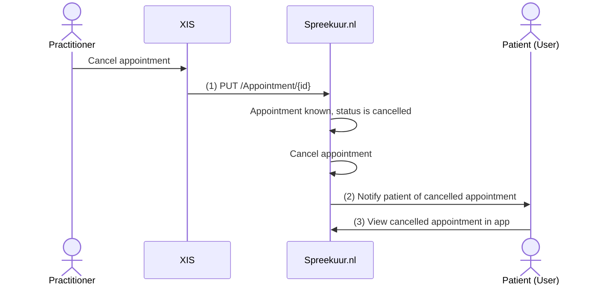

# Appointment updates by XIS

The XIS can create, modify and cancel appointments for a patient via Spreekuur.nl. This allows the practitioner
to manage appointments in the XIS, while the patient is kept informed via the Spreekuur.nl platform.

**API specifications:**
* [API Spreekuur.nl - Appointment](api-spreekuur-appointment.mdx)

## Functional summary
When a practitioner creates, modifies or cancels an appointment in the XIS, the XIS sends the updated `Appointment`
resource to Spreekuur.nl. Spreekuur.nl processes the update and notifies the patient accordingly via mail and/or push
notification.

The XIS sends a FHIR `Appointment` resource with a `PUT /Appointment/{id}` request to Spreekuur.nl. Based on the status
and whether the appointment is already known in Spreekuur.nl, the update is handled as a new appointment, a modification,
or a cancellation.

::: info
The XIS must include the `organisation_agb` header in the request, in FHIR token format:
`http://fhir.nl/fhir/NamingSystem/agb-z|{agb-code}`. A XIS can only manage appointments for its own organisations.
:::

## Create appointment
An appointment is considered new when the status is `booked` and the `Appointment` is not yet known in Spreekuur.nl.

1. The XIS sends the `Appointment` resource with status `booked` to Spreekuur.nl. See
   [Appointment](api-spreekuur-appointment.mdx#operation/updateAppointment) for the expected request body.
2. Spreekuur.nl notifies the patient via mail and/or push notification that a new appointment has been scheduled.
3. The appointment is visible in the patient's appointment overview with a notification badge.

## Modify appointment
An appointment is considered modified when the status is `booked` and the `Appointment` is already known in Spreekuur.nl.

1. The XIS sends the updated `Appointment` resource with status `booked` to Spreekuur.nl. See
   [Appointment](api-spreekuur-appointment.mdx#operation/updateAppointment) for the expected request body.
   If no fields have changed, Spreekuur.nl will not process the update.
2. Spreekuur.nl notifies the patient via mail and/or push notification that an appointment has been modified.
3. The modified appointment is visible with the updated details and a notification badge.

## Cancel appointment
An appointment is considered cancelled when the status is `cancelled` and the `Appointment` is already known in
Spreekuur.nl.

1. The XIS sends the `Appointment` resource with status `cancelled` to Spreekuur.nl. See
   [Appointment](api-spreekuur-appointment.mdx#operation/updateAppointment) for the expected request body.
2. Spreekuur.nl notifies the patient via mail and/or push notification that an appointment has been cancelled.
3. The cancelled appointment is shown in the patient's appointment overview with the status "Cancelled" and a notification badge.
