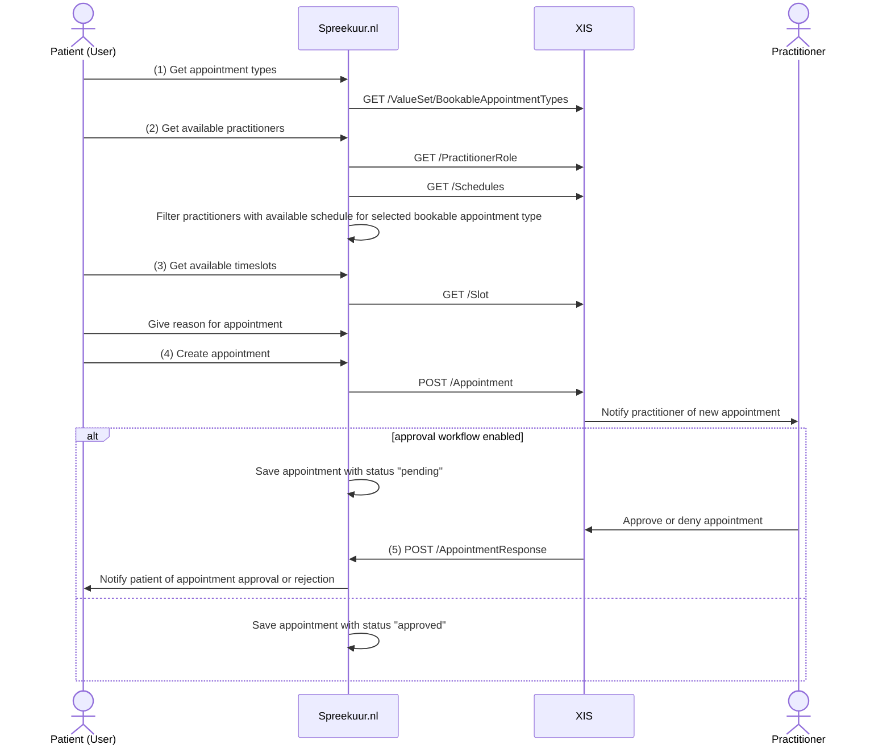
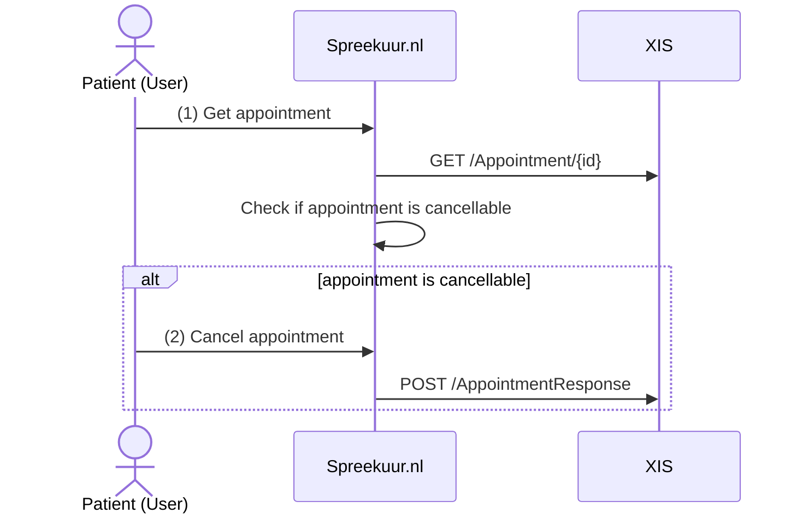

# Appointments

**Availability:**

| Environment | status       |
|-------------|--------------|
| Test        | ✅ Available  |
| Acceptance  | ✅ Available  |
| Production  | ✅ Available  |

**API specifications:**
* [API Spreekuur.nl](/openapi/appointment-spreekuur)
* [API XIS](/openapi/appointment-xis)

## Functional summary
A patient can make an appointment with a practitioner or practice via the Spreekuur.nl platform. The patient selects a
appointment type, optionally a practitioner, a timeslot and provides a reason for the appointment. The appointment is then
sent to the XIS. It is possible to include a approval workflow in the appointment process where the practitioner has to 
approve or reject the appointment before it is confirmed. Once the appointment is confirmed, the patient will receive a 
confirmation message via the Spreekuur.nl platform. 

A confirmed appointment can be cancelled by the patient or the practitioner.

## Appointment creation
To create an appointment, the following steps are taken:

1. The `BookableAppointmentTypes` ValueSet is a list of appointment types that are bookable via Spreekuur.nl. For example:
   `Physical appointment` or `Video-consult`. See [BookableAppointmentType](api-xis.mdx#operation/getBookableAppointmentTypes) 
    for more information.
2. The `PractitionerRole` resource is used to get the available practitioners for the selected appointment type. To only
   show practitioners with an available schedule, schedules for the practitioner are fetched. See 
   [PractitionerRole](api-xis.mdx#operation/getPractitionerRoles) and [Schedule](api-xis.mdx#operation/getSchedules) for the expected 
   responses.
3. The `Slot` resource is used to get the available timeslots for the selected appointment type and practitioner. The 
   selected appointment type (service category), practitioner role ids and period (schedule date) are send as filters. 
   Slots are paginated with a pages size of 7 days. See [Slot](api-xis.mdx#operation/getSlots).
4. The `Appointment` resource is used to create the appointment. See [Appointment](api-xis.mdx#operation/createAppointment) for 
   the supported and required properties.
5. The `AppointmentResponse` resource is used to approve or reject the appointment.

## Appointment cancellation
It is possible for the patient to cancel an appointment. Before the patient can cancel the appointment, the appointment 
resource is requested at the XIS. When the appointment is cancellable, the appointment cancel button is available.

1. The `Appointment` resource is used to check if the appointment is cancellable. See 
   [Appointment](api-xis.mdx#operation/searchAppointments) for the expected response.
2. The `AppointmentResponse` resource is used to cancel the appointment. See [AppointmentResponse](api-spreekuur.mdx#operation/createAppointmentResponse).