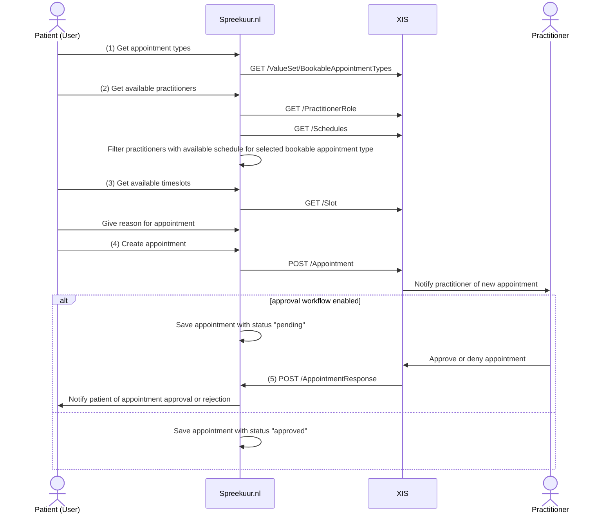

# Appointment creation V1

**API specifications:**
* [API XIS](/openapi/appointment-xis) (version 1)

## Appointment creation
To create an appointment, the following steps are taken:

1. The `BookableAppointmentTypes` ValueSet is a list of appointment types that are bookable via Spreekuur.nl. For example:
   `Physical appointment` or `Video-consult`. See [BookableAppointmentType](api/api-xis.mdx#operation/getBookableAppointmentTypes) 
    for more information.
2. The `PractitionerRole` resource is used to get the available practitioners for the selected appointment type. To only
   show practitioners with an available schedule, schedules for the practitioner are fetched. See 
   [PractitionerRole](api/api-xis.mdx#operation/getPractitionerRoles) and [Schedule](api/api-xis.mdx#operation/getSchedules) for the expected 
   responses.
3. The `Slot` resource is used to get the available timeslots for the selected appointment type and practitioner. The 
   selected appointment type (service category), practitioner role ids and period (schedule date) are send as filters. 
   Slots are paginated with a pages size of 7 days. See [Slot](api/api-xis.mdx#operation/getSlots).
4. The `Appointment` resource is used to create the appointment. See [Appointment](api/api-xis.mdx#operation/createAppointment) for 
   the supported and required properties.
5. The `AppointmentResponse` resource is used to approve or reject the appointment.
