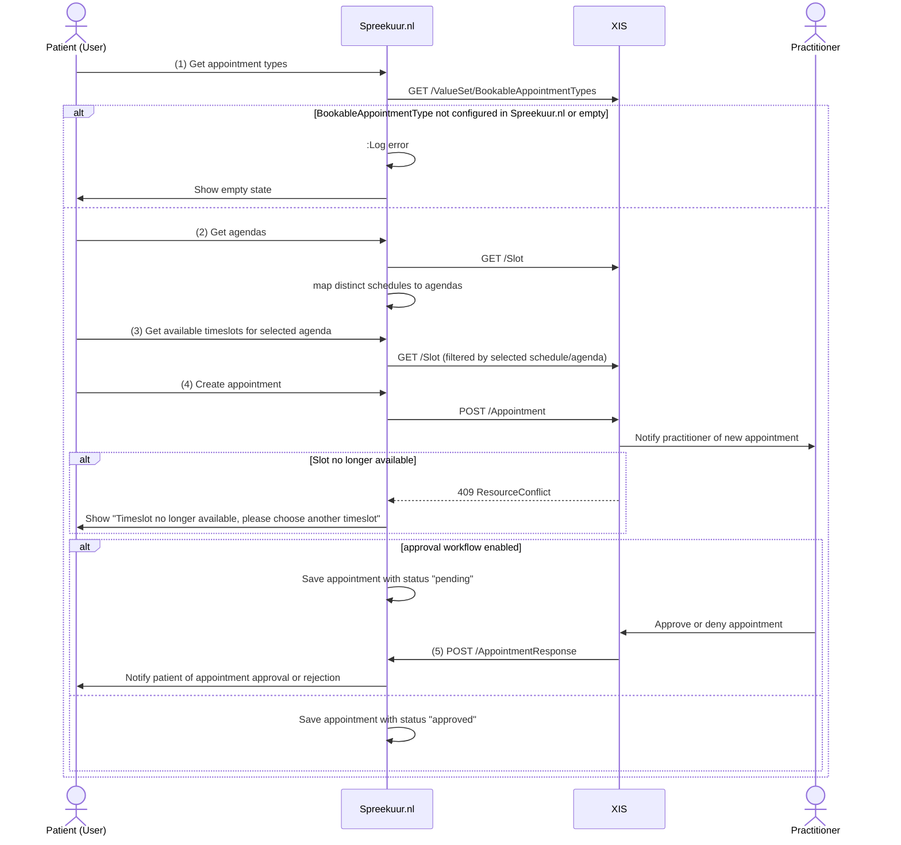

# Appointment creation V2

**API specifications:**
* [API XIS](../api-xis/api-xis-v2.mdx) (version 2)

## Appointment creation
To create an appointment, the following steps are taken:

1. The `BookableAppointmentTypes` ValueSet is a list of appointment types that are bookable via Spreekuur.nl. 
    For example: `Physical appointment` or `Video-consult`. See [BookableAppointmentType](../api-xis/api-xis-v2.mdx#operation/getBookableAppointmentTypes) for more information. 
    The query parameter `service-category` can be used to filter the appointment types based on a specific system and value 
    configured in Spreekuur.nl in case a XIS has specific appointment types that can be used in Spreekuur.nl and others are only used internally. 
2. The `Slot` resource is used (for the first time) to identify the available agendas (schedules) for the requested service-category (bookable appointment type). 
   See [Slot](../api-xis/api-xis-v2.mdx#operation/getSlots) for the expected response. The distinct schedules from the available slots are mapped to 
   agendas shown to the user. `Schedule.date=ge` (start-of-day + one day), `Schedule.date=le` (start-of-day + 28 days), `status` (free) and `service-category` are used as filters.
3. The `Slot` resource is used again to get the available timeslots for one week for the selected agenda (`schedule`) and appointment type (`service-categorie`).
   Slots are paginated with a pages size of 7 days. See [Slot](../api-xis/api-xis-v2.mdx#operation/getSlots). 
4. The `Appointment` resource is used to create the appointment. See [Appointment](../api-xis/api-xis-v2.mdx#operation/createAppointment) for 
   the supported and required properties. A `409-ResourceConflict` response is expected in case the selected slot is no longer available.
5. The `AppointmentResponse` resource is used to approve or reject the appointment when an approval workflow is used by the XIS.
