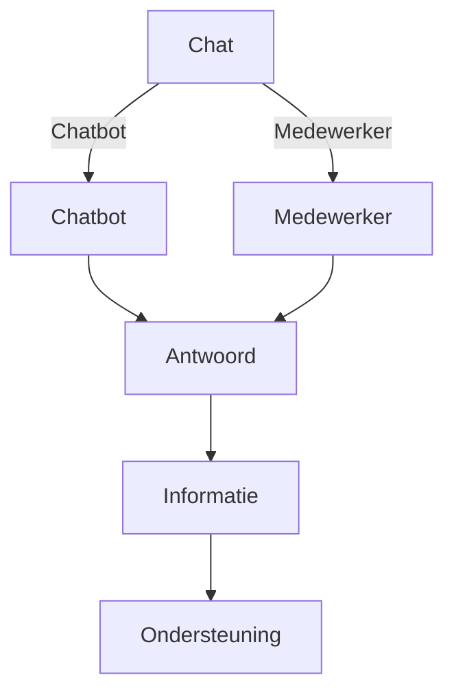

# Chat

## Functional summary
With the chat functionality, Spreekuur.nl offers a way for practitioners to communicate with patients via chat. This chat
can be started by the practitioner directly or by the patient by creating an e-consult.

## Technical summary

[Link to spec](../api/api.mdx#tag/Communication) 