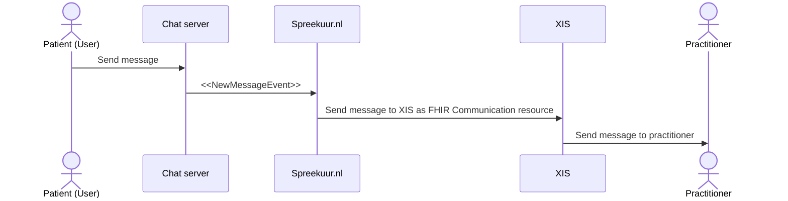
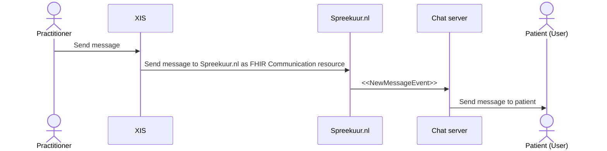

# Chat
**Availabillity:**

| Environment | status       |
|-------------|--------------|
| Test        | ✅ Available  |
| Acceptance  | ✅ Available  |
| Production  | ✅ Available  |

**FHIR Resources:**
* [Communication](../api/api.mdx#tag/Communication)
* [Encounter](../api/api.mdx#tag/Encounter)

## Functional summary
With the chat functionality, Spreekuur.nl offers a way for practitioners to communicate with patients via chat. This chat
can be started by the practitioner directly or by the patient by creating an e-consult.

### Authorization model
The authorization model for the chat functionality is based on a system trust relation. Authentication for this functionality
is not based on OAuth Token Exchange but OAuth Client Credentials Grant. This means that the BSN of th patient is not 
included in the JWT token, but provided in the FHIR Communication resource.

#### XIS to Spreekuur.nl
The XIS can start a chat with any Spreekuur.nl user which has the given practice configured in its profile. It's the 
XIS responsibility to check which practitioners are allowed to start or see specific chats.

#### Spreekuur.nl to XIS
At the moment, a Spreekuur.nl user can only start a chat with a practice and not a specific practitioner. 
The XIS is responsible for routing the message to the correct practitioner.

## Technical summary
Spreekuur.nl uses a chat service to facility the chat functionality. The Spreekuur.nl user interacts directly with this 
chat service via the Spreekuur.nl frontend. Spreekuur.nl receives message events from the chat service and translates
these events to a [FHIR Communication resource](../api/api.mdx#tag/Communication).

⚠️The translation to FHIR Communication is done by the Spreekuur.nl backend in an asynchronous way. This means that the 
Spreekuur.nl user doesn't have to wait for the message to be delivered at the XIS. A retry mechanism is in place to ensure 
that all messages send will be delivered to the XIS eventually.

### Message from Spreekuur.nl to XIS

### Message from XIS to Spreekuur.nl

## Create channel by XIS
When a Communication resource is received, Spreekuur.nl checks if a channel with the given `Communication.encounter.identifier`
already exists. If it does, the message is added to the existing channel. If it does not, a new channel is created with 
the given `Communication.encounter.identifier` as id and `Communication.topic.text` as the channel name. The
`Communication.payload` with type "StringType" is added as the first message to the new channel.

### Identification of the Spreekuur.nl user

## Close channel by XIS
To close a channel, the XIS can send a [Encounter](../api/api.mdx#tag/Encounter) with `Encounter.status` set to
"finished". Spreekuur.nl will close the channel and prevents the Spreekuur.nl user to send new messages to the channel.

### Grace period
Because of the asynchronous nature of the chat service, the XIS must still accept new messages 5 minutes after closing
the channel. This will prevent race conditions where the XIS closes the channel and the Spreekuur.nl user sends a message
at the same time.

## Add participants to channel by XIS
Spreekuur.nl will add the `Communication.sender` automatically to the channel. The `Communication.sender.display` will 
be used as the username of the participant. The username will be visible for the other participants in the channel 
(including the Spreekuur.nl user). The `Communication.sender.identifier` is used as the unique identifier.

## Attachments
Spreekuur.nl supports attachments in the chat. The attachment is uploaded to a CDN and the URL is added to the 
Communication resource. The XIS should download the attachment from the CDN and store it in its own system. 
A XIS can also send attachments in the same way to Spreekuur.nl. 

## Read notifications
Spreekuur.nl supports read notifications. This is done by sending a patch on the Communication resource with a FHIR 
extension.

Read notifications from XIS to Spreekuur.nl are not supported.