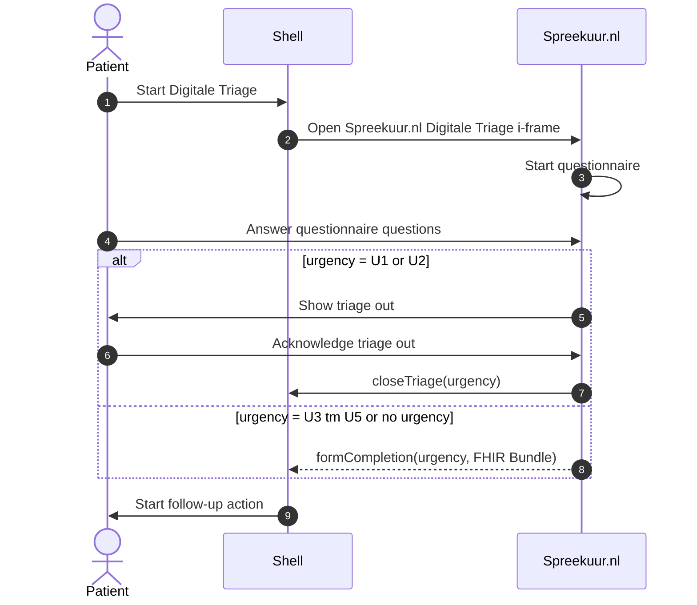

# Digitale triage
**Availability:**

| Environment | status       |
|-------------|--------------|
| Test        | ✅ Available  |
| Acceptance  | ✅ Available  |
| Production  | ✅ Available  |

## Functional summary
The Spreekuur.nl Digitale Triage functionality lets other patient portals integrate the triage functionality of Spreekuur.nl
in their own portal. This flow uses an i-frame to embed the triage functionality in the patient portal. The i-frame 
ensures that the MDR (Medical Device Regulation) requirements are met by Spreekuur.nl.

Communication between the Spreekuur.nl Digitale Triage and the patient portal uses the `postMessage` API of the browser.
See the MDN documentation for more information: https://developer.mozilla.org/en-US/docs/Web/API/Window/postMessage.

## Starting an e-consult with triage
To start an Digitale Triage, the flow is as follows:

1. The patient starts the Digitale Triage in a third party patient portal.
2. Spreekuur.nl Digitale Triage is opened in an i-frame in the patient portal.
3. Spreekuur.nl Digitale Triage starts the triage questionnaire.
4. The patient fills in the triage questionnaire.
5. If the urgency is high (U1 or U2), a triage out message* is shown to the patient. After the patient
   acknowledges the message, a `closeTriage` postMessage is sent to the patient portal containing only the
   urgency. No FHIR Bundle with clinical data is sent on this path, because the patient is being routed to
   emergency follow-up.
6. If the urgency is U3, U4, U5 or no urgency, a `formCompletion` postMessage is sent to the patient portal
   containing the urgency together with a FHIR Bundle. The Bundle contains the `Composition`, `Patient`,
   `QuestionnaireResponse`, `Observation[Urgency]`, `Condition` and `Observation[S-line]` resources describing
   the consultation.
7. The patient portal starts the follow-up action based on the received urgency.

*The triage out message advises the patient to contact the practice by the emergency phone number.

## Embedding the i-frame
The Spreekuur.nl Digitale Triage is delivered as a single-page web application that is intended to be embedded
as an i-frame inside the patient portal. The URL of the i-frame is provided by Topicus.Healthcare per environment
(test, acceptance, production).

A minimal embedding looks like this:

```html
<iframe
    src="https://<digitale-triage-url>/"
    title="Spreekuur.nl Digitale Triage"
></iframe>

<script>
    window.addEventListener('message', (event) => {
        // Restrict to the Spreekuur.nl Digitale Triage origin
        if (event.origin !== 'https://<digitale-triage-url>') {
            return;
        }
        const { key, data } = event.data ?? {};
        // Handle key === 'formCompletion' | 'closeTriage' | 'userEvent'
    });
</script>
```

The i-frame does not require any query parameters, hash fragments, or initialization messages.
The patient starts the triage from within the i-frame itself.

### Origin validation
The Spreekuur.nl Digitale Triage currently sends messages with `targetOrigin: '*'`. The patient portal **must**
validate `event.origin` against the configured Digitale Triage URL on every incoming message before acting on the
payload, and should also restrict the embedding via a Content Security Policy (`frame-src`) and the i-frame
`sandbox` attribute as appropriate.

## postMessage messages
All messages from the Spreekuur.nl Digitale Triage to the patient portal share the same envelope:

```ts
interface PostMessage {
    key: 'formCompletion' | 'closeTriage' | 'userEvent';
    data: unknown;
}
```

The `key` discriminator identifies the message type. The shape of `data` depends on the key.

### `formCompletion`
Sent when the patient has completed the triage questionnaire and the resulting urgency is **U3, U4, U5, or no
urgency**. The `data` field contains the urgency outcome together with a FHIR Bundle describing the consultation:

- `urgency.slug` — the urgency level (`U3` / `U4` / `U5`).
- `resourceType: "Bundle"` with `entry[]` containing:
    - `Composition` — the consultation envelope (SNOMED `78871000000104`, *Consultation via multimedia*).
    - `Patient` — anonymised (`id: "Anoniem"`); the XIS is expected to link the consultation to the right
      patient using its own session context.
    - `QuestionnaireResponse` — the answers given during the triage.
    - `Observation` with `id: "urgency-<Ux>"` — the urgency (`valueString`).
    - `Condition` — the patient's complaint (*klachtgebied*).
    - `Observation` with `id: "subjective-journal"` (LOINC `61146-7`, *Subjective journal line*) — the SOEP
      "S" line. The standard S-line text is in `valueString`; if a Smart S-Rule is available it is added as a
      `Smart-S-Rule` extension.

Example:

```json
{
    "key": "formCompletion",
    "data": {
        "urgency": { "slug": "U5" },
        "resourceType": "Bundle",
        "entry": [
            {
                "resource": {
                    "resourceType": "Composition",
                    "id": "1f2e3d4c-5b6a-7890-1234-567890abcdef",
                    "status": "final",
                    "type": {
                        "coding": [
                            {
                                "system": "http://snomed.info/sct",
                                "code": "78871000000104",
                                "display": "Consultation via multimedia"
                            }
                        ],
                        "text": "Consultation via multimedia"
                    },
                    "subject": { "reference": "Patient/Anoniem" },
                    "date": "2026-05-19T10:15:30Z",
                    "title": "Online consultation from Spreekuur.nl"
                }
            },
            {
                "resource": {
                    "resourceType": "Patient",
                    "id": "Anoniem"
                }
            },
            {
                "resource": {
                    "resourceType": "QuestionnaireResponse",
                    "id": "ref-questionnaire-response",
                    "status": "completed",
                    "subject": { "reference": "Patient/Anoniem" },
                    "authored": "2026-05-19T10:15:30Z",
                    "source": { "reference": "Patient/Anoniem" },
                    "item": [
                        {
                            "linkId": "1",
                            "text": "Wat is uw klacht?",
                            "answer": [{ "valueString": "Hoofdpijn" }]
                        }
                    ]
                }
            },
            {
                "resource": {
                    "resourceType": "Observation",
                    "id": "urgency-U5",
                    "status": "preliminary",
                    "subject": { "reference": "Patient/Anoniem" },
                    "effectiveDateTime": "2026-05-19T10:15:30Z",
                    "valueString": "U5"
                }
            },
            {
                "resource": {
                    "resourceType": "Condition",
                    "id": "condition",
                    "meta": {
                        "profile": ["http://hl7.org/fhir/StructureDefinition/nl-core-Condition"]
                    },
                    "clinicalStatus": {
                        "coding": [
                            {
                                "system": "http://terminology.hl7.org/CodeSystem/condition-clinical",
                                "code": "active"
                            }
                        ]
                    },
                    "verificationStatus": {
                        "coding": [
                            {
                                "system": "http://terminology.hl7.org/CodeSystem/condition-ver-status",
                                "code": "unconfirmed"
                            }
                        ]
                    },
                    "code": {
                        "coding": [{ "display": "Hoofdpijn" }]
                    },
                    "subject": { "reference": "Patient/Anoniem" }
                }
            },
            {
                "resource": {
                    "resourceType": "Observation",
                    "id": "subjective-journal",
                    "meta": {
                        "profile": ["http://hl7.org/fhir/StructureDefinition/nl-core-Observation"]
                    },
                    "extension": [
                        {
                            "url": "http://monitoring.viplive.nl/fhir/StructureDefinition/Smart-S-Rule",
                            "valueString": "slimmeSRegel"
                        }
                    ],
                    "status": "final",
                    "code": {
                        "coding": [
                            {
                                "system": "http://loinc.org",
                                "code": "61146-7",
                                "display": "Subjective journal line"
                            }
                        ],
                        "text": "Subjective journal line"
                    },
                    "subject": { "reference": "Patient/Anoniem" },
                    "effectiveDateTime": "2026-05-19T10:15:30Z",
                    "valueString": "standaardSRegel"
                }
            }
        ]
    }
}
```

After this message is sent, the i-frame closes the wizard. The patient portal should remove or hide the i-frame
and start the follow-up action based on the urgency.

### `closeTriage`
Sent when the resulting urgency is **U1 or U2** ("triage out") or when the patient ended the questionnaire
without completing it through the regular flow. The `data` field contains only the urgency outcome — no FHIR
Bundle is sent in this case, because the patient is being routed to emergency follow-up rather than to a regular
online consultation.

Example:

```json
{
    "key": "closeTriage",
    "data": {
        "urgency": { "slug": "U2" }
    }
}
```

For the U1/U2 path, the Digitale Triage first shows the triage out message to the patient. The `closeTriage`
message is sent only after the patient acknowledges that message by closing it. The patient portal should remove
or hide the i-frame and route the patient to the appropriate emergency follow-up.

### `userEvent`
Sent each time the patient interacts with the i-frame while the triage wizard is active. This is intended for the
patient portal to detect activity and implement its own session/inactivity logic; it does not carry triage data.

```ts
{
    key: 'userEvent',
    data: {
        trigger: 'click' | 'touchstart' | 'keydown' | 'keypress',
        timestamp: string  // ISO 8601, e.g. '2026-05-19T10:15:30.123Z'
    }
}
```

`userEvent` messages start once the wizard is opened and stop when the wizard is closed (either by
`formCompletion`, `closeTriage`, or the patient dismissing the wizard).

## Messages from the patient portal to the Digitale Triage
The Spreekuur.nl Digitale Triage does **not** listen for messages from the parent window. Communication is
unidirectional: the i-frame sends messages to the patient portal, but the patient portal cannot send commands or
data back to the i-frame.

## Patient cancellation
If the patient dismisses the wizard before the triage completes (for example by navigating away inside the
i-frame), no terminating `formCompletion` or `closeTriage` message is sent. The patient portal is responsible for
implementing its own inactivity handling — for example, by monitoring the `userEvent` messages and applying a
timeout when no events have been received for a configurable period.