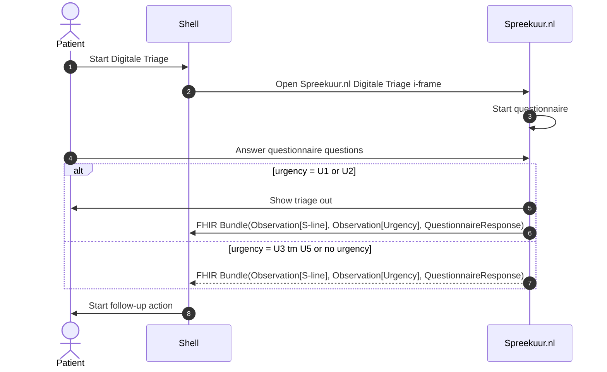

# Digitale triage
**Availability:**

| Environment | status            |
|-------------|-------------------|
| Test        | 🚧 In development |
| Acceptance  | 🛑 Unavailable    |
| Production  | 🛑 Unavailable    |

## Functional summary
The Spreekuur.nl Digitale Triage functionality lets other patient portals integrate the triage functionality of Spreekuur.nl
in their own portal. This flow uses an i-frame to embed the triage functionality in the patient portal. The i-frame 
ensures that the MDR (Medical Device Regulation) requirements are met by Spreekuur.nl.

Communication between the Spreekuur.nl Digitale Triage and the patient portal uses the `postMessage` API of the browser.
See the MDN documentation for more information: https://developer.mozilla.org/en-US/docs/Web/API/Window/postMessage.

## Starting an e-consult with triage
To start an Digitale Triage, the flow is as follows:

1. The patient starts the Digitale Triage in a third party patient portal 
2. Spreekuur.nl Digitale Triage is opened in an i-frame in the patient portal
3. Spreekuur.nl Digitale Triage starts the triage questionnaire
4. The patient fills in the triage questionnaire.
5. If the urgency is high U1 or U2, a triage out message* is shown to the patient and the triage data is sent to the 
   patient portal as a FHIR Bundle containing the Observation[S-line>], Observation[Urgency] and the QuestionnaireResponse.
6. If the urgency is U3, U4, U5 or no urgency, the triage data is sent to the patient portal as a FHIR Bundle 
   containing the Observation[S-line], Observation[Urgency] and the QuestionnaireResponse.
7. The patient portal starts the follow-up action based on the received urgency.