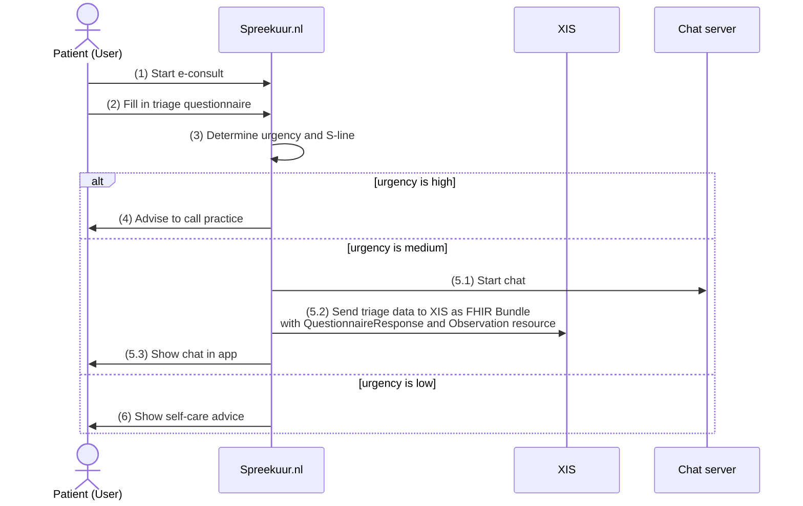

# E-consult with triage
**Availability:**

| Environment | status            |
|-------------|-------------------|
| Test        | 🚧 In development |
| Acceptance  | 🛑 Unavailable    |
| Production  | 🛑 Unavailable    |

**API specifications:**
* [API XIS](/openapi/econsult-triage-xis)

## Functional summary
When e-consult with triage functionality is enabled for an organisation, patients will be triaged before they can submit 
an e-consult. The triage process is done by a questionnaire that is filled in by the patient. Based on the answers given by the
patient an urgency will be determined. Based on that urgency the patient will either see a self-care advice, can start a chat (see [chats functionality](/features/chat/chats)) 
or will be advised to contact the practice by phone.

When a chat is started, the triage data will be sent to the XIS. The triage data contains:
- The answers of the questionnaire
- Urgency
- Automatically generated s-line (subjective journal line)
  - The S line (or "s regel") is the subjective perception of the patient about his/her complaints. 
    See https://nl.wikipedia.org/wiki/SOEPstatus (in Dutch) for more information.

## Starting an e-consult with triage
To start an e-consult with triage, the flow is as follows:

_Note: The exact followup action on a urgency level depends on the organisation type and settings. This is just an example
and illustrates all the possible followup actions._

1. The patient starts an e-consult in the Spreekuur.nl app.
2. The patient fills in the triage questionnaire.
3. Spreekuur.nl determines the urgency based on the answers given by the patient and generates an s-line.
4. If the urgency is high, the patient is advised to call the practice (triage out)
5. If the urgency is medium, a chat is started and the triage data is send to the XIS.
    1. A chat session is started in the chat service (see [chat functionality](/features/chat/chats))
    2. The triage data is send to the XIS as a FHIR Bundle containing a QuestionnaireResponse resource with the answers given by the patient and an Observation resource with the determined urgency.
    3. The patient can see the chat in the Spreekuur.nl app.
6. If the urgency is low, a self-care advice is shown to the patient.