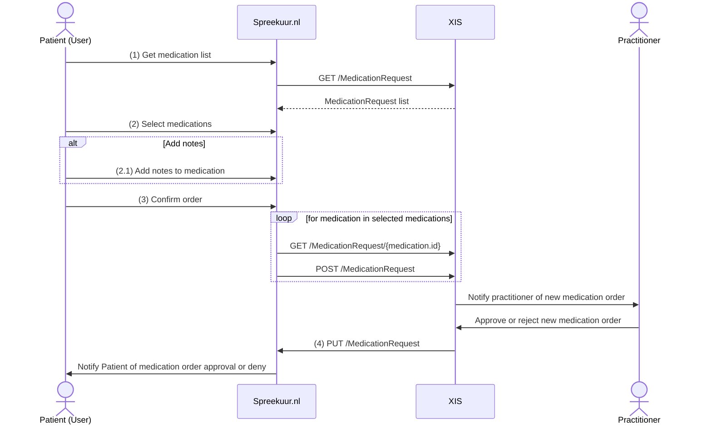

# Order medication 
**Availability:**

| Environment | status       |
|-------------|--------------|
| Test        | ✅ Available  |
| Acceptance  | ✅ Available  |
| Production  | ✅ Available  |

**API specifications:**
* [API Spreekuur.nl](/openapi/medication-spreekuur)
* [API XIS](/openapi/medication-xis)

## Functional summary
With the Order Medication feature patients can order medication via Spreekuur.nl. The practitioner can approve or reject
the order in the XIS. The patient will be notified and can see the status of the order in Spreekuur.nl.

Note: This functionality is called "Order Medication". However, the patient can't just order new medications but repeats
a previous prescribed medication. The XIS is responsible to only return medications which the patient can order / repeat.

## Order medication
The flow to order medication is as follows:

1. The patient requests a list of orderable medications. This XIS is responsible to only return medications which can be
    ordered by the patient.
2. The patient can select one or more medications from the list.
   1. Optionally the patient can add a note to each medication in the list.
3. After the patient confirms the order, Spreekuur.nl will send each chosen medication separately to the XIS. It will 
   first request the MedicationRequest again from the XIS and modify the following properties before sending it back:
   1. Remove the 'id' field
   2. Add property 'authoredOn' and set it to now
   3. Add property 'basedOn' with a reference to the original MedicationRequest
   4. Set property 'status' to 'draft'
   5. Optionally add the note of the patient
4. The practitioner is notified of the new medication order and can approve or reject the order. 
   1. When the order is approved, the patient receives a notification from Spreekuur.nl the order can be collected at
      the pharmacy.
   2. When the order is rejected, the patient receives a notification from Spreekuur.nl. Optionally, the practitioner can 
      add a message which will be added to the notification.
