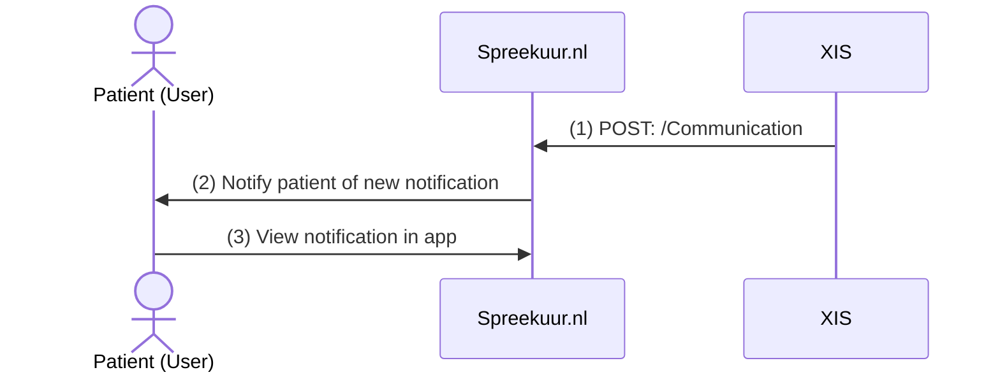

# Notifications
**Availability:**

| Environment | status            |
|-------------|-------------------|
| Test        | 🚧 In development |
| Acceptance  | 🛑 Unavailable    |
| Production  | 🛑 Unavailable    |

**API specifications:**
* [API Spreekuur.nl](/openapi/notification-spreekuur)

## Functional summary
With the Notification feature, practitioners can send one-way messages to patients. Patients cannot respond to these messages.
Typical use cases are: 
* Informing patient about lab results
* Inviting a patient for a vaccination
* Etc.

## Send a notification
To send a notification, the flow is as follows:

1. The XIS can post a Communication resource with "category" set to "notification" to Spreekuur.nl.
2. Spreekuur.nl will notify the patient of the new notification via mail and or push notification.
   1. When the patient is not registered in Spreekuur.nl yet, and the XIS provides an email address in the Communication resource,
      Spreekuur.nl will send an invitation to register.
3. The patient can view the notification in the Spreekuur.nl app.
