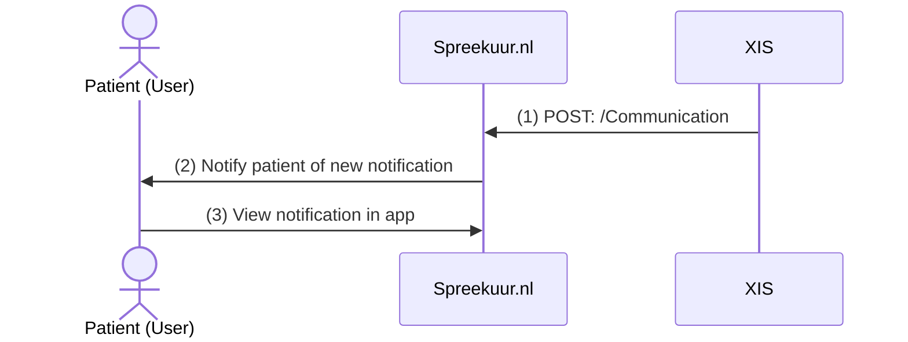

# Notifications
**Availability:**

| Environment | status            |
|-------------|-------------------|
| Test        | ✅ Available      |
| Acceptance  | ✅ Available      |
| Production  | ✅ Available      |

**API specifications:**
* [API Spreekuur.nl](api-spreekuur.mdx)

## Functional summary
With the Notification feature, practitioners can send one-way messages to patients. Patients cannot respond to these messages.
Typical use cases are: 
* Informing patient about lab results
* Inviting a patient for a vaccination
* Etc.

## Technical summary
The notification API consists of a single FHIR `Communication` endpoint provided by Spreekuur.nl.
The XIS sends a notification to this endpoint. 

Notifications are one-way messages from the XIS to the patient. The patient can read the message in Spreekuur.nl,
but cannot reply through this API.

## Authorization model
Authentication from the XIS to Spreekuur.nl is based on the
[OAuth 2.0 Client Credentials Grant](../../authentication-and-multi-tenancy.md#authentication-from-xis-to-spreekuurnl).

The organizational context of the request follows the general multi-tenancy rules described in
[Authentication and multi tenancy](../../authentication-and-multi-tenancy.md).

## Send a notification
To send a notification, the flow is as follows:

```mermaid
sequenceDiagram
    actor Patient (User)
    participant Spreekuur.nl
    participant XIS
    
    XIS->>Spreekuur.nl: (1) POST: /Communication
    Spreekuur.nl->>Patient (User): (2) Notify patient of new notification
    Patient (User)->>Spreekuur.nl: (3) View notification in app
```

1. The XIS sends a FHIR `Communication` resource to the Spreekuur.nl endpoint using a POST request.
   The request must represent a notification and therefore include a `Communication.category` entry with code `notification`.
2. Spreekuur.nl will notify the patient of the new notification via mail and/or push notification.
   1. When the patient is not registered in Spreekuur.nl yet, and the XIS provides an email address in the Communication resource,
      Spreekuur.nl will send an invitation to register.
3. The patient can view the notification in the Spreekuur.nl app.

## Communication resource requirements
The notification endpoint expects a FHIR `Communication` resource.

At minimum, the request should contain:
- `Communication.category` with a coding whose `code` is `notification`
- `Communication.topic.text` with the subject shown to the patient (max. 500 characters)
- `Communication.payload[].contentString` with the message body (min. 1, max. 10.000 characters)
- `Communication.recipient[].reference` pointing to the contained `Patient`
- A contained `Patient` resource with a BSN in `Patient.identifier`

Optionally, the contained `Patient` can include an email address in `Patient.telecom`. This is used by Spreekuur.nl
to invite the patient to register when the patient is not yet known in the platform.

The logical id (`Communication.id`) is optional and will be assigned by Spreekuur.nl if not provided.

## Validation and error handling
Spreekuur.nl validates whether the incoming `Communication` can be processed as a notification.

Requests are rejected when:
- `Communication.category` is missing
- `Communication.category` does not identify the resource as a notification
- `Communication.topic.text` exceeds 500 characters
- `Communication.payload[].contentString` is empty or exceeds 10.000 characters

See the [API Spreekuur.nl](api-spreekuur.mdx) page for the public request schema.
