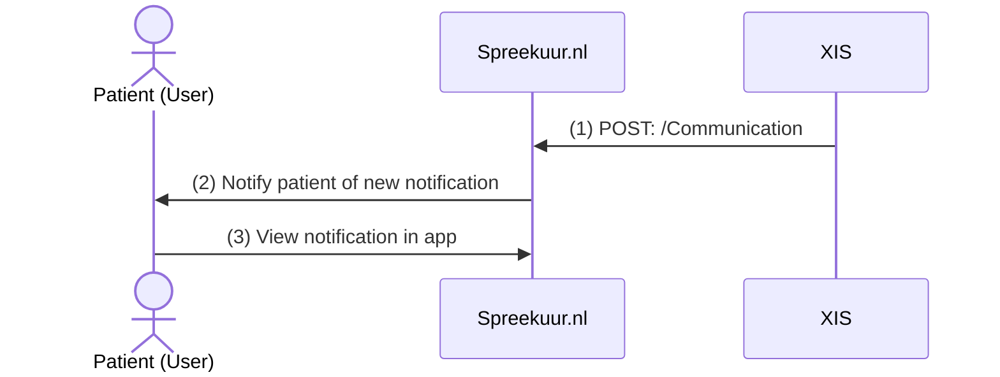
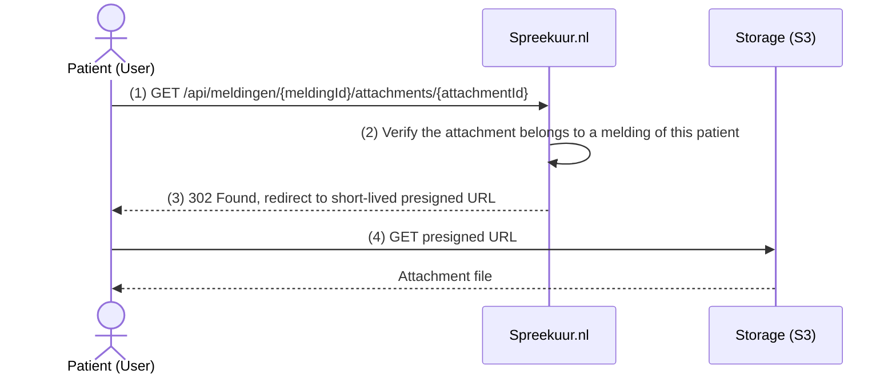

# Notifications
**Availability:**

| Environment | status            |
|-------------|-------------------|
| Test        | ✅ Available      |
| Acceptance  | ✅ Available      |
| Production  | ✅ Available      |

**API specifications:**
* [API Spreekuur.nl](api-spreekuur.mdx)

## Functional summary
With the Notification feature, practitioners can send one-way messages to patients. Patients cannot respond to these messages.
Typical use cases are: 
* Informing patient about lab results
* Inviting a patient for a vaccination
* Etc.

A notification can optionally include one or more attachments (e.g. a PDF lab report or a scanned document).
The patient can view and download these attachments together with the message in the Spreekuur.nl app.

## Technical summary
The notification API consists of a single FHIR `Communication` endpoint provided by Spreekuur.nl.
The XIS sends a notification to this endpoint. 

Notifications are one-way messages from the XIS to the patient. The patient can read the message in Spreekuur.nl,
but cannot reply through this API.

## Authorization model
Authentication from the XIS to Spreekuur.nl is based on the
[OAuth 2.0 Client Credentials Grant](../../authentication-and-multi-tenancy.md#authentication-from-xis-to-spreekuurnl).

The organizational context of the request follows the general multi-tenancy rules described in
[Authentication and multi tenancy](../../authentication-and-multi-tenancy.md).

## Send a notification
To send a notification, the flow is as follows:

```mermaid
sequenceDiagram
    actor Patient (User)
    participant Spreekuur.nl
    participant XIS
    
    XIS->>Spreekuur.nl: (1) POST: /Communication
    Spreekuur.nl->>Patient (User): (2) Notify patient of new notification
    Patient (User)->>Spreekuur.nl: (3) View notification in app
```

1. The XIS sends a FHIR `Communication` resource to the Spreekuur.nl endpoint using a POST request.
   The request must represent a notification and therefore include a `Communication.category` entry with code `melding`.
2. Spreekuur.nl will notify the patient of the new notification via mail and/or push notification.
   1. When the patient is not registered in Spreekuur.nl yet, and the XIS provides an email address in the Communication resource,
      Spreekuur.nl will send an invitation to register.
3. The patient can view the notification in the Spreekuur.nl app.

## Communication resource requirements
The notification endpoint expects a FHIR `Communication` resource.

At minimum, the request should contain:
- `Communication.category` with a coding whose `code` is `melding`
- `Communication.topic.text` with the subject shown to the patient (max. 500 characters)
- `Communication.payload[].contentString` with the message body (min. 1, max. 10.000 characters)
- `Communication.recipient[].reference` pointing to the contained `Patient`
- A contained `Patient` resource with a BSN in `Patient.identifier`

Optionally, the contained `Patient` can include an email address in `Patient.telecom`. This is used by Spreekuur.nl
to invite the patient to register when the patient is not yet known in the platform.

The logical id (`Communication.id`) is optional and will be assigned by Spreekuur.nl if not provided.

### Attachments
A notification may optionally contain attachments. Each attachment is sent as a `Communication.payload[]` entry
holding a `contentAttachment` instead of a `contentString`. Per attachment the following fields are required:

- `Communication.payload[].contentAttachment.data` — the file contents, base64-encoded
- `Communication.payload[].contentAttachment.contentType` — the MIME type of the file
- `Communication.payload[].contentAttachment.title` — the file name shown to the patient and used as the download
  file name

A single `Communication` can contain both the message (`contentString`) and one or more attachment payload entries.

The following constraints apply to attachments:

| Constraint                                     | Value                                                                                                                                                                                                                                                                                                                                |
|------------------------------------------------|--------------------------------------------------------------------------------------------------------------------------------------------------------------------------------------------------------------------------------------------------------------------------------------------------------------------------------------|
| Maximum number of attachments per notification | 5                                                                                                                                                                                                                                                                                                                                    |
| Allowed content types                          | `application/pdf`, `image/jpeg`, `image/png`, `application/msword`, `application/vnd.openxmlformats-officedocument.wordprocessingml.document`, `application/vnd.ms-excel`, `application/vnd.openxmlformats-officedocument.spreadsheetml.sheet` |

In addition to the `contentType` declared in the request, Spreekuur.nl detects the actual file type from the
attachment contents. Both the declared `contentType` and the detected file type must be in the list of allowed
content types. This prevents files of a disallowed type from being uploaded under a permitted `contentType`
(for example an executable renamed to look like a PDF).

## Validation and error handling
Spreekuur.nl validates whether the incoming `Communication` can be processed as a notification.

Requests are rejected when:
- `Communication.category` is missing
- `Communication.category` does not identify the resource as a notification
- `Communication.topic.text` exceeds 500 characters
- `Communication.payload[].contentString` is empty or exceeds 10.000 characters

Requests with attachments are additionally rejected when:
- the notification contains more than 5 attachments
- an attachment is missing its `data`, `contentType` or `title`
- an attachment uses a `contentType` that is not in the list of allowed content types
- the file type detected from the attachment contents is not in the list of allowed content types

When the request is rejected, no attachments are stored: attachments are only persisted once the complete
notification is successfully processed.

See the [API Spreekuur.nl](api-spreekuur.mdx) page for the public request schema.

## Downloading attachments
Attachments are not embedded in the notification shown in the app. Instead, the patient downloads each attachment
on demand through Spreekuur.nl, which streams it from object storage (S3).

```mermaid
sequenceDiagram
    actor Patient (User)
    participant Spreekuur.nl
    participant Storage (S3)

    Patient (User)->>Spreekuur.nl: (1) GET /api/meldingen/{meldingId}/attachments/{attachmentId}
    Spreekuur.nl->>Spreekuur.nl: (2) Verify the attachment belongs to a melding of this patient
    Spreekuur.nl-->>Patient (User): (3) 302 Found, redirect to short-lived presigned URL
    Patient (User)->>Storage (S3): (4) GET presigned URL
    Storage (S3)-->>Patient (User): Attachment file
```

1. The patient (authenticated as a Spreekuur.nl user) requests an attachment by its melding and attachment id.
2. Spreekuur.nl verifies that the requested attachment belongs to a notification addressed to the logged-in patient.
   If the melding or attachment cannot be found for this patient, a `404 Not Found` is returned.
3. Spreekuur.nl responds with a `302 Found` redirect to a short-lived presigned URL (valid for one minute).
   The redirect is marked as non-cacheable. The presigned URL sets the download file name to the attachment `title`.
4. The patient's client follows the redirect and downloads the file directly from object storage.
