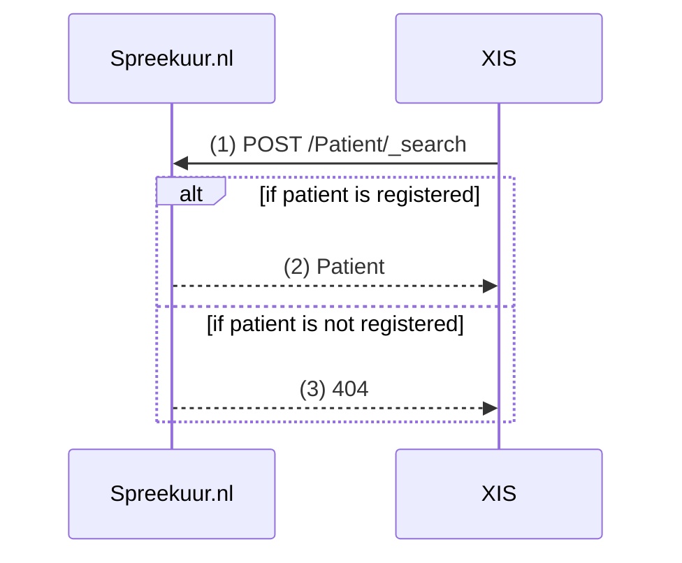
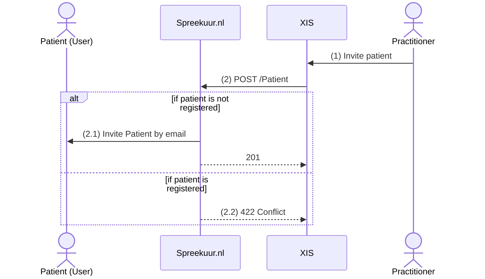
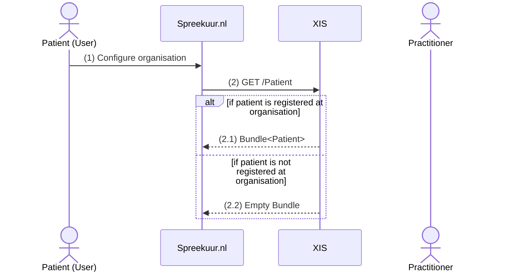

# Patient Discovery
**Availability:**

| Environment | status       |
|-------------|--------------|
| Test        | ✅ Available  |
| Acceptance  | ✅ Available  |
| Production  | ✅ Available  |

## Functional summary
With the Patient Discovery API a XIS can query Spreekuur.nl whether a Patient with a given BSN is already registered. It is 
also possible to invite a patient to start using Spreekuur.nl. The patient will receive an email with a link to 
the login page of Spreekuur.nl with the inviting organisation pre-selected. 

The XIS must also provide an API for Spreekuur.nl to query if a patient with a given BSN is registered at a organisation
with a given AGB. Spreekuur.nl uses this API to check if a patient is registered at the organisation before starting 
functional flows such as booking an appointment or starting triage for an e-consult.

## XIS to Spreekuur.nl Patient Discovery
The flow to discover a patient is as follows:

1. The XIS queries Spreekuur.nl for a patient with the given BSN. 
    1. ⚠️ A [FHIR POST](https://build.fhir.org/search.html#searchinputs) based search is used to prevent the BSN from being logged in webserver logs.
2. If the patient is registered, Spreekuur.nl returns the Patient resource.
3. If the patient is not registered, Spreekuur.nl returns a 404 Not Found response.

## XIS to Spreekuur.nl Invite Patient
The flow to invite a patient is as follows:

1. The practitioner invites a patient in the XIS.
2. The XIS sends a POST request to Spreekuur.nl to invite the patient with a BSN and email.
    1. If the patient is not registered, Spreekuur.nl sends an email to the patient with a link to the login page of 
        Spreekuur.nl with the inviting organisation pre-selected.
    2. If the patient is already registered, Spreekuur.nl returns a 422 Conflict response.

## Spreekuur.nl to XIS Patient Discovery
The flow to discover if a patient is registered at a given organisation is as follows:

1. The patient configures the organisation in Spreekuur.nl.
2. Spreekuur.nl queries the XIS for patients. Based on the BSN in the access token, the XIS queries if the patient is registered at the organisation.
   1. If the patient is registered, the XIS returns a Bundle with the Patient resource.
   2. If the patient is not registered, the XIS returns an empty Bundle.